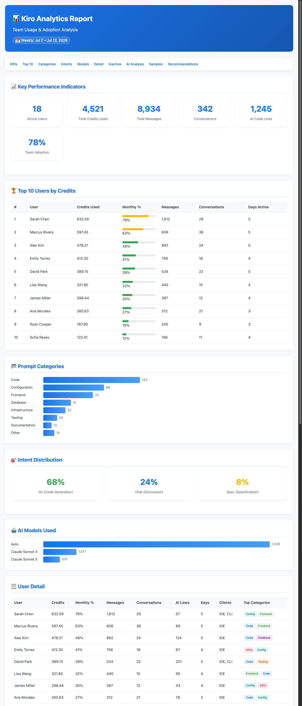

# Kiro Analytics Pipeline

Serverless analytics pipeline for [Kiro](https://kiro.dev) (AI coding assistant) usage tracking, deployed on AWS. Generates weekly and monthly team activity reports including credit metrics, interactions, prompt categorization, and AI analysis with Amazon Bedrock.



## Architecture

```
EventBridge (scheduling) → Step Functions (orchestration)
  ├── Lambda Validator → validates parameters
  ├── Lambda Collectors (x3 in parallel) → reads logs from S3
  ├── Lambda Processor → aggregates metrics → persists to DynamoDB
  ├── Lambda AI Analyzer → invokes Bedrock Claude Haiku 4.5
  ├── Lambda Report Generator → HTML/CSV → S3 + pre-signed URLs
  ├── Lambda Publisher → CloudFront website
  └── Lambda Notifier → SNS → email
```

### AWS Services Used

| Service | Purpose |
|---------|---------|
| Lambda | 9 independent functions for each pipeline stage |
| Step Functions | Orchestration with parallelism, retries, and graceful degradation |
| S3 | Log source, report storage, static website |
| DynamoDB | Processed metrics persistence (on-demand) |
| EventBridge | Automatic scheduling (weekly/monthly) |
| Bedrock | AI analysis of prompts with Claude Haiku 4.5 |
| CloudFront | Web distribution protected with Basic Auth |
| SNS | Email notifications |
| CloudWatch | Logs, custom metrics, alarms |

---

## Features

- Weekly and monthly reports in HTML and CSV (daily on-demand)
- Per-user metrics: credits, conversations, messages, AI code lines, inline completions
- Prompt categorization by topic (Code, Infrastructure, Database, Testing, Frontend, etc.)
- Intent classification (do/chat/spec) and AI model distribution
- AI prompt analysis with Claude Haiku 4.5 via Bedrock (`invoke_model` API)
- Inactive user identification and adoption recommendations
- Monthly usage calculation against 1,000 credits/user Kiro Pro limit
- Automatic scheduling: weekly (Friday) and monthly (1st) via EventBridge
- Web publishing with Basic Auth via CloudFront
- Email notifications (success/failure) via SNS
- Historical persistence in DynamoDB
- Graceful degradation: partial reports if Bedrock or publishing fails
- Prompt samples per user in HTML report

---

## Prerequisites

### Software

- Python 3.9+ (recommended 3.13)
- AWS CDK CLI v2 (`npm install -g aws-cdk`)
- AWS CLI v2 configured with credentials
- Node.js 18+ (required by CDK CLI)

### AWS Access

- AWS account with permissions to create: Lambda, Step Functions, DynamoDB, S3, EventBridge, SNS, CloudFront, IAM roles, CloudWatch
- Access to Kiro logs bucket (format: `dev-logs-prompt-kiro-<ACCOUNT_ID>-<REGION>-an`)
- Bedrock permissions for model `us.anthropic.claude-haiku-4-5-20251001-v1:0`

---

## Installation

```bash
# Clone the repository
git clone https://github.com/derocox-cloud/kiro-analytics.git
cd kiro-analytics

# Create virtual environment
python3 -m venv .venv
source .venv/bin/activate

# Install dependencies (development + CDK)
pip install -e ".[dev,cdk]"
```

### Verify installation

```bash
# Run all tests (461+)
pytest

# Unit tests only
pytest tests/unit/

# Property-Based Tests only
pytest tests/pbt/

# Integration tests only
pytest tests/integration/
```

---

## Configuration

### 1. Configure stack parameters

Edit `infrastructure/app.py` with your production values:

```python
config = StackConfig(
    logs_bucket="dev-logs-prompt-kiro-<ACCOUNT_ID>-<REGION>-an",
    account_id="<ACCOUNT_ID>",
    region="us-east-1",
    notification_emails=["admin@your-company.com"],
    authorized_emails=["team@your-company.com"],
    bedrock_model_id="us.anthropic.claude-haiku-4-5-20251001-v1:0",
    python_runtime="python3.13",
    log_retention_days=30,
    report_retention_days=90,
)
```

### 2. Prepare the user roster

The roster defines which users are included in reports. CSV format:

```csv
Username,Display name,Status,Email,User ID
jdoe,John Doe,Enabled,jdoe@company.com,uuid-001
jsmith,Jane Smith,Enabled,jsmith@company.com,uuid-002
inactive,Inactive User,Disabled,inactive@company.com,uuid-003
```

- Only users with `Status=Enabled` are processed
- The file is read from S3 on each execution (updatable without redeployment)
- Default location: `s3://<reports-bucket>/config/kiro-users-dev.csv`

### 3. Enable Bedrock access

Verify that Claude Haiku 4.5 is enabled in your region:

```bash
aws bedrock list-foundation-models \
  --query "modelSummaries[?modelId=='anthropic.claude-haiku-4-5-20251001-v1:0']" \
  --region us-east-1
```

If not listed, enable it from the AWS Console → Bedrock → Model access.

---

## Deployment

### Step 1: Bootstrap CDK environment (first time only)

```bash
cdk bootstrap aws://<ACCOUNT_ID>/us-east-1
```

### Step 2: Synthesize template (verify without deploying)

```bash
PYTHONPATH=. cdk synth --app "python3 infrastructure/app.py"
```

### Step 3: Deploy the stack

```bash
PYTHONPATH=. cdk deploy KiroAnalyticsPipeline --app "python3 infrastructure/app.py"
```

### Step 4: Confirm SNS subscriptions

Each recipient will receive a confirmation email from SNS. They must click the confirmation link to start receiving notifications.

### Step 5: Upload roster to S3

```bash
aws s3 cp kiro-users.csv \
  s3://<REPORTS_BUCKET>/config/kiro-users-dev.csv
```

### Step 6: Verify with manual execution

```bash
aws stepfunctions start-execution \
  --state-machine-arn arn:aws:states:us-east-1:<ACCOUNT_ID>:stateMachine:kiro-analytics-pipeline \
  --input '{"period": "weekly", "reference_date": "2026-07-07", "ai_analysis": true}'
```

---

## Manual Execution

### Input Parameters

| Parameter | Type | Required | Values | Default |
|-----------|------|----------|--------|---------|
| `period` | string | ✅ | `daily`, `weekly`, `monthly` | — |
| `reference_date` | string | ✅ | Format `YYYY-MM-DD` | — |
| `ai_analysis` | boolean | ❌ | `true`, `false` | `true` |
| `output_format` | string | ❌ | `html`, `csv`, `both` | `both` |

### Examples

```bash
STATE_MACHINE_ARN="arn:aws:states:us-east-1:<ACCOUNT_ID>:stateMachine:kiro-analytics-pipeline"

# Weekly report
aws stepfunctions start-execution \
  --state-machine-arn $STATE_MACHINE_ARN \
  --input '{"period": "weekly", "reference_date": "2026-07-07"}'

# Monthly report
aws stepfunctions start-execution \
  --state-machine-arn $STATE_MACHINE_ARN \
  --input '{"period": "monthly", "reference_date": "2026-06-01"}'

# Without AI analysis (faster, no Bedrock cost)
aws stepfunctions start-execution \
  --state-machine-arn $STATE_MACHINE_ARN \
  --input '{"period": "weekly", "reference_date": "2026-07-07", "ai_analysis": false}'
```

---

## Automatic Scheduling

Once deployed, EventBridge automatically executes:

| Schedule | Frequency | Time (UTC-5) | Period |
|----------|-----------|--------------|--------|
| Weekly | Friday | 7:00 AM | `weekly` |
| Monthly | 1st day | 7:00 AM | `monthly` |

---

## Graceful Degradation

| Failing Component | Behavior | Report Generated |
|-------------------|----------|------------------|
| Bedrock (AI analysis) | Continues without AI | ✅ Without AI analysis section |
| Web publishing | Continues with indicator | ✅ Available via pre-signed URL |
| Notification | Logs to CloudWatch | ✅ Pipeline marks success |
| Collection (1 source) | Total pipeline failure | ❌ No report generated |

---

## Project Structure

```
kiro-analytics/
├── src/                          # Pipeline source code
│   ├── pipeline.py               # Entry point (orchestrates all stages)
│   ├── models.py                 # Shared data models
│   ├── validators/               # Input and roster validation
│   ├── collectors/               # Data collection from S3
│   ├── processors/               # Processing and metrics aggregation
│   ├── analyzers/                # AI analysis with Bedrock
│   ├── generators/               # Report generation and publishing
│   ├── notifiers/                # SNS notifications
│   ├── orchestrator/             # Lambda handler and orchestration
│   └── utils/                    # Shared utilities
├── infrastructure/               # AWS CDK (IaC)
│   ├── app.py                    # CDK entry point
│   ├── pipeline_stack.py         # Main stack
│   └── state_machine.py          # Step Functions state machine
├── tests/                        # 461+ tests
│   ├── unit/                     # Unit tests
│   ├── pbt/                      # Property-Based Tests (Hypothesis)
│   └── integration/              # Integration tests (moto)
├── examples/                     # Sample report output
│   └── sample-report.html        # Example HTML report with dummy data
└── pyproject.toml                # Dependencies and project config
```

---

## Sample Report

A sample HTML report with dummy data is available in `examples/sample-report.html`. Open it in your browser to preview the report format including:

- KPI dashboard
- Top 10 users by credits
- Prompt categories distribution
- Intent classification
- AI model usage
- User detail table
- Inactive users
- AI analysis section
- Prompt samples
- Recommendations

---

## Estimated Costs (USD/month)

| Service | Estimated Cost | Notes |
|---------|---------------|-------|
| Lambda | ~$1-5 | 9 functions, ~90 executions/month |
| Step Functions | ~$0.50 | ~90 state transitions/month |
| DynamoDB | ~$1-3 | On-demand, ~3000 writes/month |
| S3 | ~$0.50-2 | Report storage + temp logs |
| EventBridge | Free | First 14M events included |
| Bedrock | ~$5-20 | Depends on prompt volume analyzed |
| CloudFront | ~$0.50-1 | Low traffic (internal team) |
| SNS | ~$0.10 | ~90 emails/month |
| CloudWatch | ~$1-3 | Logs + metrics + alarms |
| **Total** | **~$10-35/month** | Typical usage for 20-50 user team |

---

## Contributing

Contributions are welcome! Please open an issue or pull request.

## License

MIT
